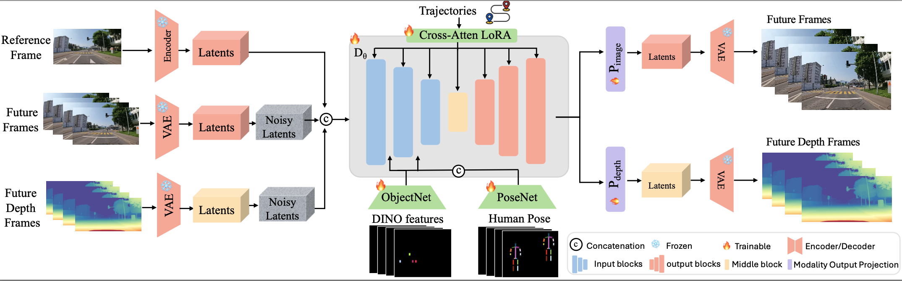

<p align="center">
  <h1 align="center">💎 GEM: Generalizable Ego-Vision Multimodal World Model</h1>
  <p align="center">
    <strong>Authors</strong><br/>
    Mariam Hassan<sup>★1</sup>, Sebastian Stapf<sup>★2</sup>, Ahmad Rahimi<sup>★1</sup>, Pedro M. B. Rezende<sup>★2</sup>, Yasaman Haghighi<sup>♦1</sup><br/>
    David Brüggemann<sup>♦3</sup>, Isinsu Katircioglu<sup>♦3</sup>, Lin Zhang<sup>♦3</sup>, Xiaoran Chen<sup>♦3</sup>, Suman Saha<sup>♦3</sup><br/>
    Marco Cannici<sup>♦4</sup>, Elie Aljalbout<sup>♦4</sup>, Botao Ye<sup>♦5</sup>, Xi Wang<sup>♦5</sup>, Aram Davtyan<sup>2</sup><br/>
    Mathieu Salzmann<sup>1,3</sup>, Davide Scaramuzza<sup>4</sup>, Marc Pollefeys<sup>5</sup>, Paolo Favaro<sup>2</sup>, Alexandre Alahi<sup>1</sup>
  </p>
  <p align="center">
    <sup>1</sup>École Polytechnique Fédérale de Lausanne (EPFL) &nbsp;&nbsp;
    <sup>2</sup>University of Bern &nbsp;&nbsp;
    <sup>3</sup>Swiss Data Science Center &nbsp;&nbsp;
    <sup>4</sup>University of Zurich &nbsp;&nbsp;
    <sup>5</sup>ETH Zurich
  </p>
  <p align="center">
    <sup>★</sup> Main Contributors &nbsp;&nbsp; <sup>♦</sup> Data Contributors
  </p>
</p>
<h2 align="center">
   <p>CVPR 2025</p>
   <a href="https://openaccess.thecvf.com/content/CVPR2025/papers/Hassan_GEM_A_Generalizable_Ego-Vision_Multimodal_World_Model_for_Fine-Grained_Ego-Motion_CVPR_2025_paper.pdf" align="center">Paper</a> | 
   <a href="https://vita-epfl.github.io/GEM.github.io/" align="center">Website</a>
</h2>


https://github.com/user-attachments/assets/02098c63-b7f3-47c2-a54d-787303b60ea9

Welcome to the official repository for **GEM**: *A Generalizable Ego-Vision Multimodal World Model for Fine-Grained Ego-Motion, Object Dynamics, and Scene Composition Control*. This repository contains the codebase, data processing pipeline, and instructions for training, sampling, and evaluating our world model.


## 📝 Overview

**GEM** is a multimodal world model designed for:
- Fine-grained **ego-motion modeling**.
- Capturing **object dynamics** in complex environments.
- Flexible **scene composition control** in ego-centric vision tasks.

This repository allows researchers and developers to reproduce our results and further explore the capabilities of our world model.



---

## 📋 Contents

- [Installation](#installation)
- [Dataset Preparation](#dataset-preparation)
- [Training](#training)
- [Sampling](#sampling)
- [Evaluation](#evaluation)
- [Model Architecture](#model-architecture)
- [Citations](#citations)

---

## 🚀 Installation


### Recommended: Use Docker

We provide a Dockerfile that builds the exact same environment used for development and training

1. Clone the repository

```bash
git clone https://github.com/vita-epfl/GEM.git
cd GEM
```
2. Build the Docker image
```docker build -t gem:latest .```

3.  Run the container (with GPU support)
```
docker run --gpus all -it --rm \
  -v $(pwd):/workspace \
  gem:latest \
  bash
```

---

## GEM Checkpoint

We released the model weights of GEM v1.0 at [HuggingFace](https://huggingface.co/mariam-hassan/GEM/blob/main/gem.safetensors)


## 📂 Dataset Preparation

To get started quickly, we provide [sample data](https://drive.google.com/file/d/1azq1RGmaCOSK9eJdY0WiYuBhD210rlKt/view?usp=share_link) you can use to run training, sampling, or evaluation.

Alternatively, you can follow the steps below to prepare your own dataset.

1. Obtain the dataset:
   - Download the datasets from their respective websites (e.g. [BDD100K](https://www.vis.xyz/bdd100k/)).
   - Convert the videos to individual frames using data_processing/fast_ffmpeg.py
      
   Example usage:
      ```bash
      python preprocess_opendv/fast_ffmpeg.py --video_dir VIDEOS_PATH --output_dir IMAGES_PATH
      ```
   - Gather the frames into .h5 files using data_processing/convert_to_h5.py
      
   Example usage:
      ```bash
      python preprocess_opendv/fast_h5.py --data_dir IMAGES_PATH --out_dir H5_PATH
      ```

2. To generate the pseudo-labels (depth, trajectories and calibration), see the [instructions in the README](pseudo_labeling_pipeline/README.md).

3. The final directory structure should look like:
   
   ```
   data/
   ├── bdd100k/
   │   ├── h5/
   │   │   ├── file1.h5
   │   │   ├── curation_file1.csv
   │   │   ├── trajectory_file1.h5
   |   │   └── depth_file1.h5
   ```

   - Make sure ./data is in the same folder as the cloned repository.

4. Prepare the metadata:
   - Run:
   ```bash
   python data_processing/prepare_data.py
   ```

   - This will generate a csv file with all of the curation information and validate the files you downloaded.

5. Your data is now ready! You can now proceed with training.

---

## 🏋️‍♂️ Training

Train GEM from scratch or fine-tune a pre-trained model as follows:
1. Update the configuration in `configs/train_config.yaml` as needed.
2. Run the training script:
   ```bash
   python train.py --config configs/train_config.yaml
   ```

### Key Configurations
- In your training config, you can specify the control signal and modalities you want to use for training. For example:
   ```yaml
   data:
     target: gem.data.curated_dataset.CuratedSampler 
     params:
       data_dict:
         - depth_img
         - trajectory
         - rendered_poses
   ```
   Will enable training with depth images, trajectories, and keyposes as input modalities.
   Only the modalities and controls specified in the `data_dict` will be used for training.
- **Batch size**: Adjust `batch_size` in the config file based on your GPU memory.
- **Distributed Training**: For multi-GPU training, use:
  ```bash
  torchrun --nproc_per_node=4 train.py --config configs/train_config.yaml
  ```
  or use SLURM if on a cluster.

---

## 🎨 Sampling

Make sure the checkpoint is 
 ```
   checkpoints/
   ├──gem.safetensors
   ```
Before running the script, double-check that the dataset paths are correctly set in `sample.py`.

Check the dataset paths in the 'sample.py' before you run the script.

### Sampling Instructions

Generate unconditional samples or condition on specific inputs:
1. Generate unconditional samples:
   ```bash
   python sample.py --save path/to/save/generated_samples --condition_type unconditional
   ```
2. Generate conditional samples (with `object_manipulation`, `skeleton_manipulation`, `ego_motion` as control signal options):
   ```bash
   python sample.py --save path/to/save/generated_samples --condition_type object_manipulation
   ```


---

## 📊 Evaluation

After following the Sampling steps and generating videos, either conditional or unconditional, you can evaluate the model using the following command:
```bash
python evaluate.py --dir path/to/generated_samples --condition_type object_manipulation
```
with the appropriate `condition_type` based on the control signal used during sampling. Using ‘unconditional’ will assess the visual quality of the generated samples and provide FID and FVD metrics.

### Metrics
The evaluation reports the following metrics:
- **FID/FVD**: Fréchet Inception/Video Distance for generative quality.
- **ADE**: Average Displacement Error to compare the trajectory of the ego car in the generated video and the ground truth one.
- **COM**: Control Object Manipulation metric to evaluate the pixel misplacement of the manipulated object.
- **AP**: Average Precision to evaluate the quality of the generated pedestrian skeletons, based on COCO evaluation metrics.

---

## 🧠 Model Architecture

The architecture of GEM consists of:
1. **Ego-Motion Encoder**: Processes input ego-motion sequences.
2. **Object Dynamics Module**: Models interactions between dynamic entities.
3. **Scene Decoder**: Reconstructs and generates realistic scenes.

For a detailed explanation, please refer to the paper [here](LINK_TO_PAPER).

---

## 📜 Citations

If GEM contributes to your research, please cite our paper:
```
@misc{hassan2024gemgeneralizableegovisionmultimodal,
      title={GEM: A Generalizable Ego-Vision Multimodal World Model for Fine-Grained Ego-Motion, Object Dynamics, and Scene Composition Control}, 
      author={Mariam Hassan and Sebastian Stapf and Ahmad Rahimi and Pedro M. B. Rezende and Yasaman Haghighi and David Brüggemann and Isinsu Katircioglu and Lin Zhang and Xiaoran Chen and Suman Saha and Marco Cannici and Elie Aljalbout and Botao Ye and Xi Wang and Aram Davtyan and Mathieu Salzmann and Davide Scaramuzza and Marc Pollefeys and Paolo Favaro and Alexandre Alahi},
      year={2024},
      eprint={2412.11198},
      archivePrefix={arXiv},
      primaryClass={cs.CV},
      url={https://arxiv.org/abs/2412.11198}, 
}
```

---

For questions or issues, feel free to open an [issue](https://github.com/your_username/gem-world-model/issues).

Happy researching! 🚗🎥

--- 

## Acknowledgements

Our implementation is built on [generative-models](https://github.com/Stability-AI/generative-models) and [vista](https://github.com/OpenDriveLab/Vista). Thanks to their developers for the open-source work!
